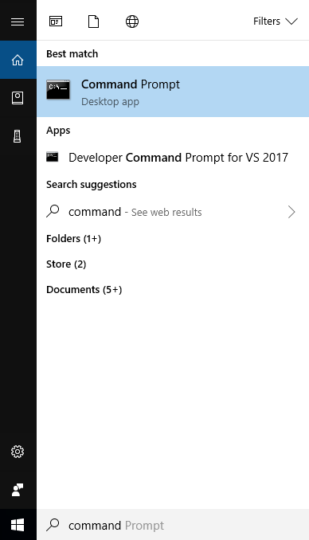

# Command-line Computing Exercise

## Command Prompt (Windows OS)

Open the Command Prompt application.

> FYI: If you are into maximum efficiency through keyboard shortcuts, get there quick by pressing the "windows" button, then begin typing the word "command", then hit enter when you see "Command Prompt" show up. :smiley_cat:
>
> 


### Current User

Print the current user's name.

```` sh
whoami
````

### Present Working Directory

Print the current/present working directory.

```` sh
cd
````

### List Files in a Directory

List files in the current working directory.

```` sh
dir
````

### Navigate and Manage Directories

Change directories (specifying absolute file path).

```` sh
cd C:\Users\YOUR_USERNAME\Desktop\ # where YOUR_USERNAME is the name of the user currently operating your local machine
````

Make a new directory.

```` sh
mkdir my_folder
````

Remove a directory.

```` sh
rmdir my_folder
````

### Manage Files

Change directories (using relative file path).

```` sh
cd my_folder # first re-create this directory if it doesn't exist, else this will trigger an error
````

Create a file.

```` sh
type nul > README.md
type nul > index.html
type nul > my_data.csv
type nul > my_message.txt
````

Remove/delete a file.

```` sh
del index.html
````

Edit and save a file, using a text editor like nano, atom, sublime, or vim.

```` sh
atom my_message.txt # requires "Install Shell Commands" from the Atom Settings
````

Print file contents.

```` sh
type my_message.txt
````

Move a file to target location.

```` sh
move C:\Users\YOUR_USERNAME\Desktop\my_folder\my_message.txt C:\Users\YOUR_USERNAME\Desktop
````

> FYI: If you are into maximum efficiency, press "tab" to auto-complete file paths so you don't have to type the whole thing. :smiley_cat:

Copy a file.

```` sh
xcopy C:\Users\YOUR_USERNAME\Desktop\my_message.txt C:\Users\YOUR_USERNAME\Desktop\my_folder
````

Copy contents of a file into the clipboard for pasting.

```` sh
type C:\Users\YOUR_USERNAME\Desktop\my_folder\my_message.txt | clip
# ... then just paste as you normally would after copying some text
````

### Further Exploration

Optionally explore additional command-line interfaces, if you're curious.

#### Internet Computing

Trace the route traveled by a network request:

```` sh
tracert google.com # stop after a few seconds if necessary by pressing: control + c
````

Time the duration of a network request:

```` sh
ping google.com # stop after a few seconds if necessary by pressing: control + c
````

Download the [cURL](https://curl.haxx.se/download.html) utility if necessary, then request the contents of a webpage:

```` sh
curl google.com
curl http://www.google.com
curl https://raw.githubusercontent.com/prof-rossetti/georgetown-opim-557-201803/master/exercises/web-requests/data/teams.json
````

You may need to execute these commands from within the downloaded directory. See ["Installing cURL on Windows"](http://stackoverflow.com/questions/9507353/how-do-i-install-set-up-and-use-curl-on-a-windows) for more support.
