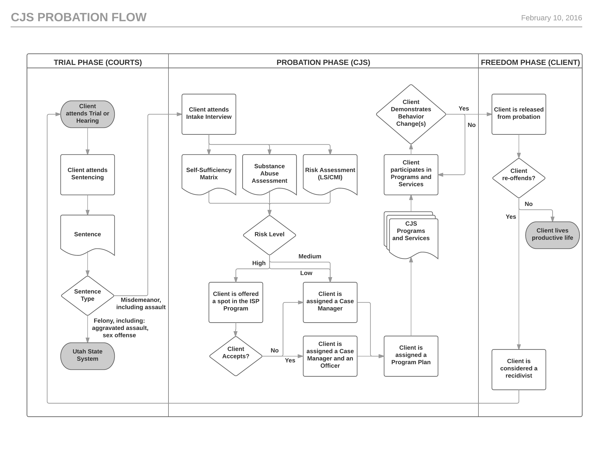
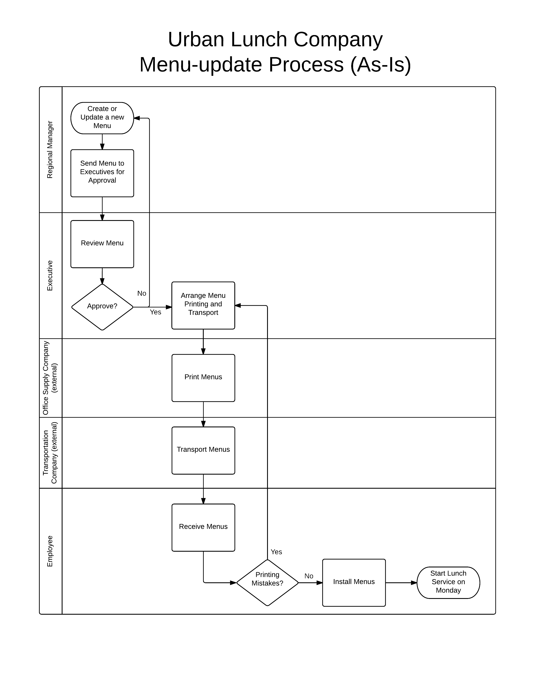
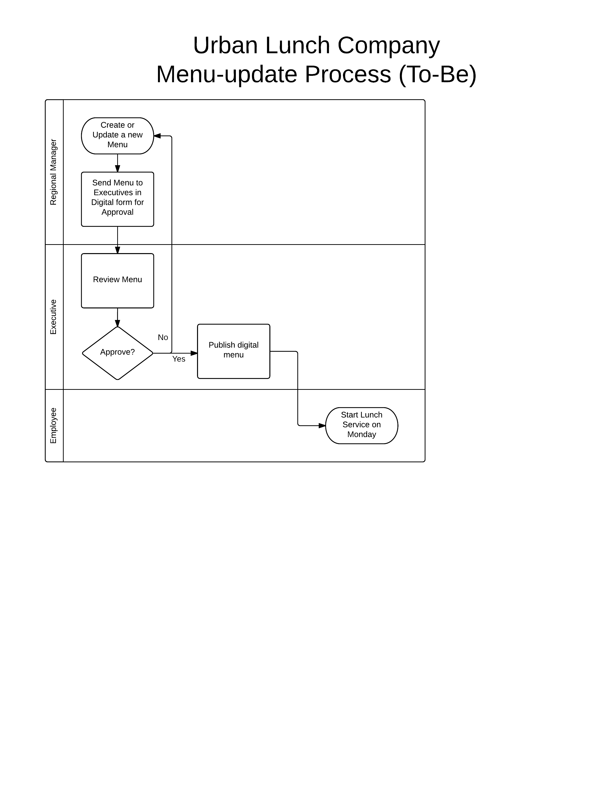
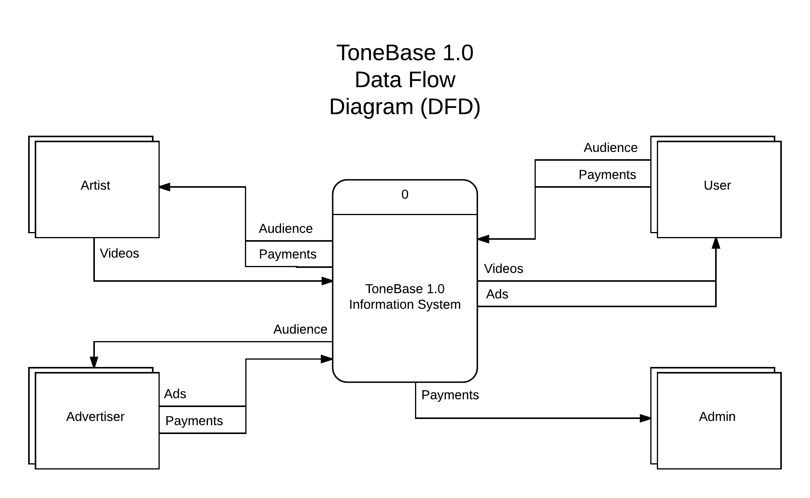

# System Diagramming

Digital diagramming tools:

  + Word Processing or Presentation Software (basic capabilities)
  + Diagramming Software (full capabilities):
     + [MS Visio](https://products.office.com/en-us/visio/flowchart-software)
     + [Omnigraffle](https://www.omnigroup.com/omnigraffle)
     + [LucidChart](https://www.lucidchart.com/) <-- recommended for class purposes

## Process Diagrams

**Process Diagrams** depict the flow and scope of a business process from start to finish. These diagrams are often accompanied by written descriptions of the various component sub-processes.

### Shapes

shape | purpose
--- | ---
circle or oval | a "terminator" which indicates the start or end steps of the process
square or rectangle | a sub-process, or step in the overall process
line with an arrow | points from one step to another to indicate sequential flow, including sub-process dependencies
diamond | denotes a "decision-point" in the process, including conditions under which different outcomes are possible
square with a squiggly bottom | a "document" produced by, or related to, a step in the process

Additionally, some process diagrams use visual separators called "swim lanes" to indicate which stakeholders are responsible for each sub-process.

### Current vs Future State

The act of writing a process description and creating a process diagram usually leads to a better understanding of that process.

Example "as-is" process diagram (see also accompanying [written description](https://github.com/prof-rossetti/salad-system-requirements/blob/master/requirements/business-processes/menu-update-process.md)):

Example "to-be" process diagram:

## Data Flow Diagrams

