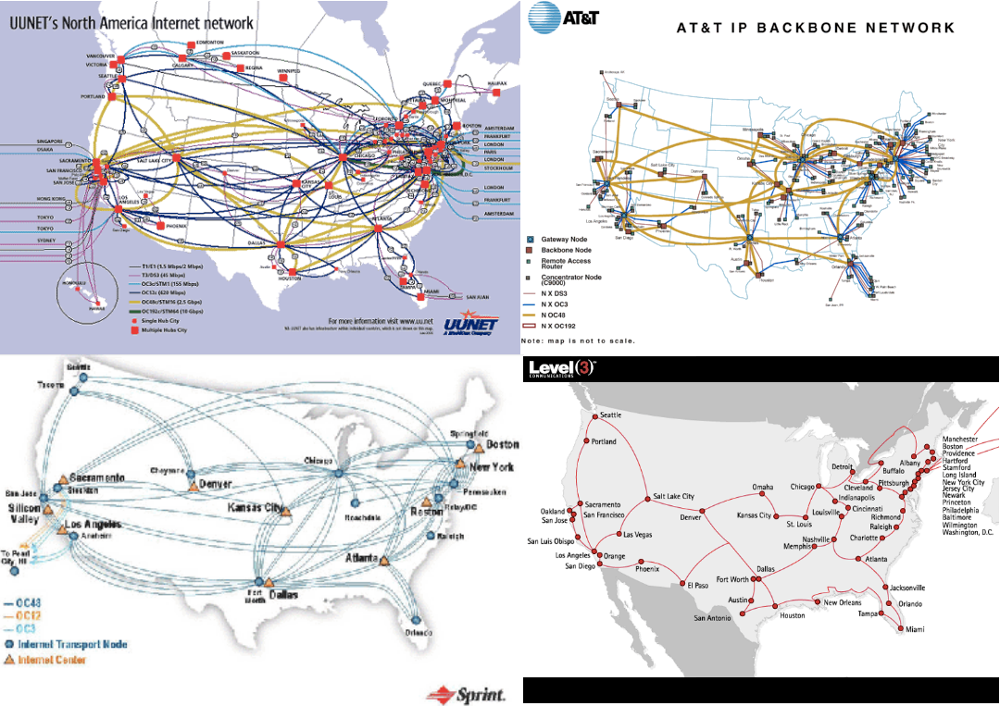

# Computer Networks Overview

A **Computer Network** is a system of interconnected computers which use "communications media" to transmit data to each other.

**Communications Media** refer to the pathways, or methods, by which data are transmitted. **Cable Media** transmit information over physical wires or cables, whereas **Broadcast Media** (e.g. Bluetooth, WiFi, Cellular radio, Satellite radio) transmit information through electromagnetic waves.

## The Internet

The Internet is the most prevalent computer network in the world.

### Internet Architecture

The most popular Internet architecture is called **Client-Server**. The **Client** is a computer which makes a request for information, whereas the **Server** provides a response to fulfill the client's request.

### Internet Protocols

Reference:

  + [Mozila Reference on HTTP](https://developer.mozilla.org/en-US/docs/Web/HTTP)
  + [HTTP Documentation](http://httpwg.org/specs/)

The Internet primarily relies on the **Hyper Text Transfer Protocol (HTTP)**, which specifies rules and standards for sending and receiving information.

According to HTTP, a client computer can issue different kinds of requests to the server. A client can either ask for data from the server (known as a `GET` request), or send some data to the server and ask the server to process it (e.g. `POST` and other types of request).

This course focuses exclusively on `GET` requests. The most common way a computer can issue a `GET` request is by visiting some URL in a browser. But a computer is also capable of programmatically issuing `GET` requests using command-line utilities and modern programming languages. Like other programming languages, [Python provides a way](/notes/programming-languages/python/packages/requests.md) for the developer to write programs which issue HTTP requests.
